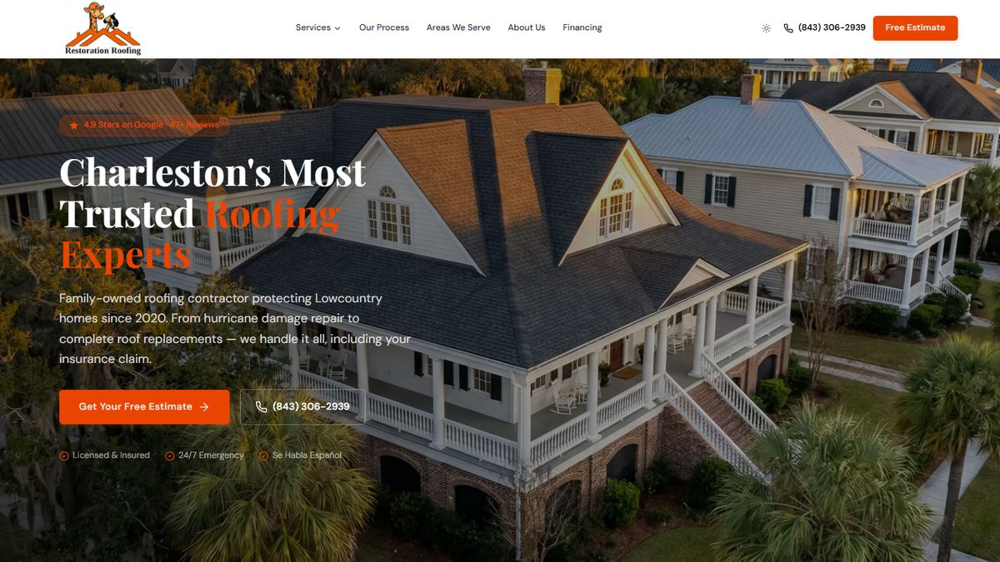

# Restoration Roofing SC



**Server-rendered Next.js website for Restoration Roofing, a family-owned roofing contractor serving 21 communities across the Charleston, SC Lowcountry.**

**Live:** [rr-sc-website.vercel.app](https://rr-sc-website.vercel.app)

---

## Tech Stack

| Layer | Technology |
|-------|-----------|
| Framework | Next.js 15 (App Router) + React 19 + TypeScript |
| Rendering | SSR + SSG (73 pages pre-rendered at build time) |
| Styling | Tailwind CSS 4 + shadcn/ui + Radix UI |
| Animations | Framer Motion |
| Fonts | `next/font` (DM Sans + Playfair Display) |
| Icons | Lucide React |
| Database | Supabase (PostgreSQL + pgvector) |
| AI / Chat | OpenAI gpt-4o-mini + text-embedding-ada-002 (RAG) |
| Analytics | Google Analytics 4 |
| Hosting | Vercel |

---

## Features

- **73 pre-rendered pages** — every page delivers full server-rendered HTML to search engines and AI crawlers
- **34 service pages** (roofing, gutters, storm damage) + 3 hub pages, each with unique metadata and JSON-LD structured data
- **21 location pages** targeting city/service keyword combinations across the Charleston metro area
- **AI chat widget** — giraffe mascot powered by RAG (13,000-word knowledge base embedded in Supabase pgvector), with instant roof estimate calculator and lead scoring
- **Blog CMS** — Supabase-backed with SSR, hardcoded fallback, and AI blog post generator endpoint
- **Contact form** — server-side Zod validation, Supabase storage, webhook notifications, rate limiting
- **SEO/AEO optimized** — enriched JSON-LD schemas (Service, RoofingContractor, LocalBusiness, FAQPage, BreadcrumbList), geo meta tags, sitemap.xml, Open Graph + Twitter Cards
- **Context-aware internal linking** — cross-category related services, scored location links, nearby areas with county-adjacency fallback
- **Dark mode** with system preference detection
- **Security headers** via vercel.json, RLS on all Supabase tables, server-only API keys

---

## Project Structure

```
rr-sc-website/
├── src/
│   ├── app/                          # Next.js App Router
│   │   ├── layout.tsx                # Root layout (fonts, providers, Header, Footer, ChatWidget, GA4)
│   │   ├── page.tsx                  # Homepage (Server Component)
│   │   ├── about/                    # About page
│   │   ├── contact/                  # Contact page
│   │   ├── financing/                # Financing page
│   │   ├── portfolio/                # Portfolio / gallery
│   │   ├── reviews/                  # Customer reviews
│   │   ├── materials-comparison/     # Materials comparison tool
│   │   ├── blog/                     # Blog listing
│   │   │   └── [slug]/              # Blog post detail (SSR)
│   │   ├── services/
│   │   │   └── [slug]/              # Service hubs + detail pages (SSG, 37 pages)
│   │   ├── areas-we-serve/           # Location listing
│   │   │   └── [slug]/              # Location detail pages (SSG, 21 pages)
│   │   └── api/
│   │       ├── chat/                 # RAG chat endpoint (OpenAI + Supabase pgvector)
│   │       ├── contact/              # Contact form submission
│   │       ├── blog/                 # Blog listing + detail
│   │       └── blog/generate/        # AI blog post generator
│   ├── components/
│   │   ├── Header.tsx                # Navigation with services mega-dropdown
│   │   ├── Footer.tsx                # Footer with location links
│   │   ├── ChatWidget.tsx            # Giraffe mascot AI chat widget
│   │   ├── FadeIn.tsx                # Reusable animation wrapper (Framer Motion)
│   │   ├── shared.tsx                # PageHero, CTABanner, SectionHeader, JsonLdScript, etc.
│   │   └── ui/                       # shadcn/ui component library (45+ components)
│   └── lib/
│       ├── data.ts                   # All business content, services, locations (~1,400 lines)
│       ├── linking.ts                # Context-aware internal linking (4 scoring functions)
│       ├── supabase.ts               # Supabase client
│       └── utils.ts                  # Utility helpers
├── lib/
│   └── knowledgebase/                # RAG knowledge base (13,000 words)
├── public/
│   ├── sitemap.xml                   # Static sitemap (75+ URLs)
│   └── robots.txt                    # Crawler directives
├── scripts/
│   ├── ingest-knowledge.ts           # Knowledge base embedding pipeline
│   └── seed-blog-posts.ts            # Blog post seeder
├── supabase/
│   └── migrations/                   # Database schema (3 migrations)
├── next.config.ts                    # Next.js config (images, aliases)
├── vercel.json                       # Security headers
└── .env.example                      # Required environment variables
```

---

## API Endpoints

| Endpoint | Method | Auth | Purpose |
|----------|--------|------|---------|
| `/api/chat` | POST | Rate limited (20/min) | RAG chat with lead scoring |
| `/api/contact` | POST | Rate limited (5/min) | Contact form submission |
| `/api/blog` | GET | Public | List published blog posts |
| `/api/blog/[slug]` | GET | Public | Single blog post |
| `/api/blog/generate` | POST | ADMIN_SECRET | AI-generate a new blog post |

---

## Getting Started

```bash
# Install dependencies
npm install

# Set up environment variables
cp .env.example .env
# Fill in: OPENAI_API_KEY, NEXT_PUBLIC_SUPABASE_URL, NEXT_PUBLIC_SUPABASE_ANON_KEY,
#          SUPABASE_SERVICE_ROLE_KEY, ADMIN_SECRET, NEXT_PUBLIC_GA4_MEASUREMENT_ID

# Run development server
npm run dev

# Build for production
npm run build
```

---

## Deployment

Deployed via Vercel CLI to the `sc-roofing` team:

```bash
git push origin main
vercel --prod --scope sc-roofing --yes
```

---

## Database

| Table | Purpose |
|-------|---------|
| `contact_submissions` | Form submissions |
| `roofing_knowledge` | RAG knowledge chunks (33 rows, pgvector) |
| `chat_conversations` | Chat session history + lead scores |
| `blog_posts` | Blog content (9 seeded) |

All tables use Row Level Security (RLS).
